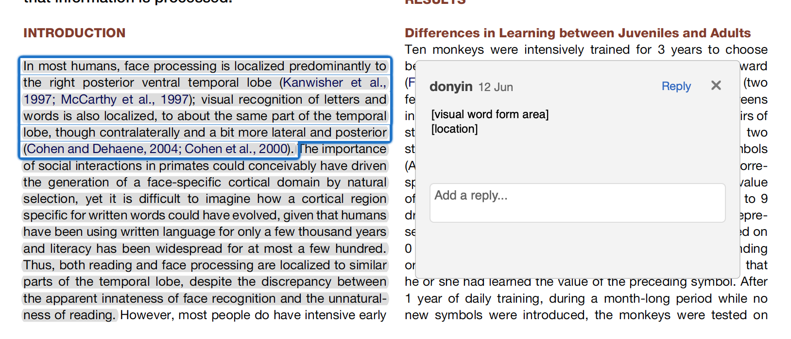
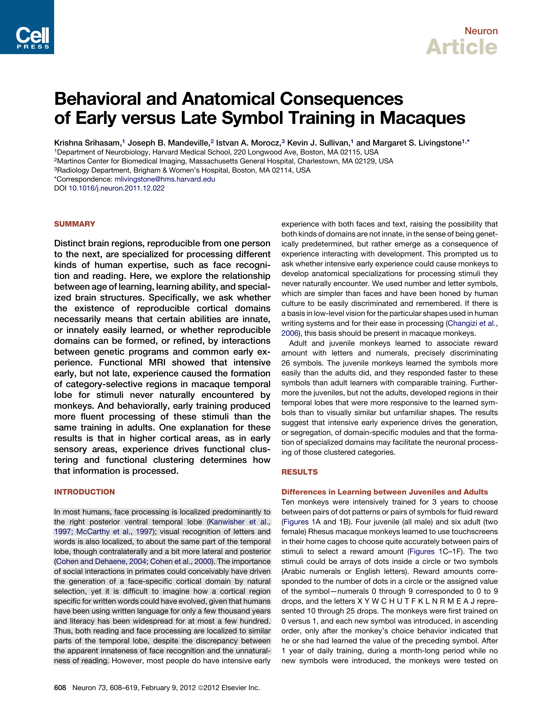
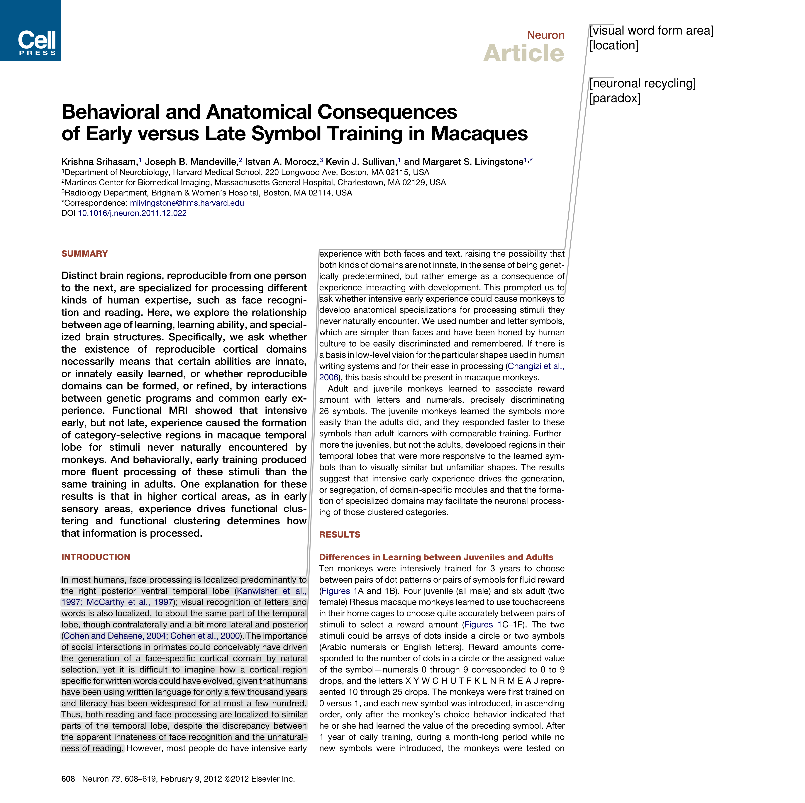

# PPA
A simple script written in fitz that adds highlight annotations to page margins.

## How does it work?
Assume we have a PDF file with some highlighted text and annotations:


```python
make_printable(Path("example.pdf"))
```
Original             |  Processed
:-------------------------:|:-------------------------:
  |  